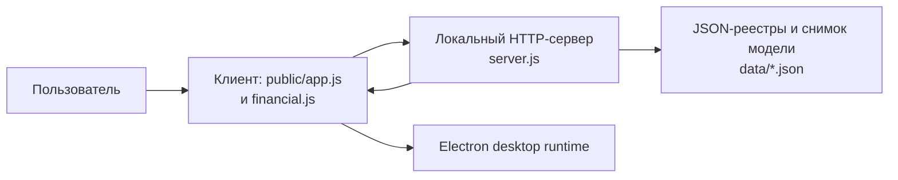
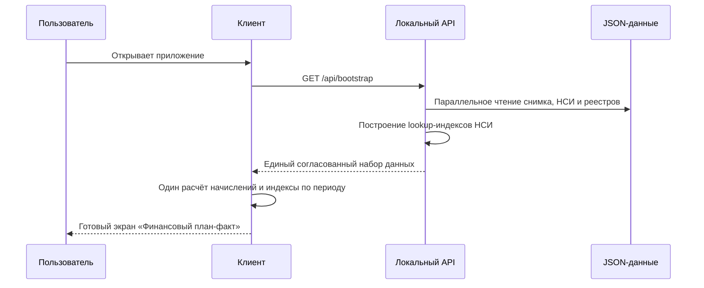

# Архитектурный анализ производительности Budget 1.4.1

Дата: 26.08.2026. Граница анализа: исходники ветки `codex/feature/v1-4-1-performance`, локальные JSON-данные `data/*.json`, desktop runtime версии 1.4.0. Секреты, персональные токены и настройки GitHub в анализ не включались.

## Контекст и компоненты

| Компонент | Ответственность | Вход / выход | Хранилище | Изменение 1.4.1 |
| --- | --- | --- | --- | --- |
| Клиентский расчёт | План-факт, начисления, таблицы и фильтры | JSON API → DOM | Только оперативная память | Кэш начислений и индексы фактов по ресурсам / сотрудникам. |
| Локальный API | Чтение реестров, применение НСИ, выдача данных | HTTP JSON | `data/*.json` | Единый `GET /api/bootstrap`, быстрые справочные lookup-индексы. |
| Данные | Первичные реестры и НСИ | Файлы JSON | Локальная рабочая копия | Не менялись. |
| Desktop runtime | Запуск локального API и интерфейса | Electron | Профиль пользователя | Не менялся в этой оптимизации. |

## Поток запуска

## Причины задержек и исправления

| Подтверждённый факт | Влияние | Исправление |
| --- | --- | --- |
| Финансовый расчёт заново обходил все ресурсы для каждой комбинации проекта и сценария. | Повторные помесячные вычисления на старте. | Кэш результата по состоянию реестров и выбранным годам; индексы начислений, событий и фактических часов. |
| Подрядные записи разрешали проект, поставщика и ресурс через линейный поиск НСИ для каждой строки. | Самый медленный API `GET /api/subcontracts`: около 1,09 с. | Lookup-индексы НСИ с сохранением прежнего правила выбора первой записи. |
| Старт состоял из семи HTTP-запросов, повторно читавших одни и те же файлы. | Лишнее чтение JSON и согласование состояний. | `GET /api/bootstrap` читает исходные файлы параллельно и возвращает единый набор данных. |

## Контрольные результаты

Условия: локальный сервер на рабочей машине, существующий набор данных, cold/warm сценарии браузера без записи тестовых данных.

| Операция | До | После | Результат |
| --- | ---: | ---: | --- |
| Готовность первого финансового экрана | ~8,55 с | ~0,25 с | Улучшение примерно в 34 раза. |
| `GET /api/bootstrap`, среднее из 5 запросов | ~1,35 с | ~0,11 с | Улучшение примерно в 13 раз. |
| Переходы «Доходы», «Проектные расходы», «Прочий подряд», «Суммы и часы», «Команда», «НСИ» | не измерялись как отдельный норматив | ~0,28–0,30 с | Укладываются в 1 секунду. |

Автотесты: 8/8. Проверяется и единый API запуска, и существующие финансовые сценарии. Открытые риски: скорость на сетевой папке или с существенно большим объёмом данных должна быть повторно измерена отдельно; клиентский кэш инвалидируется после получения новых массивов данных с API.
